# Project 2
## Github ACtions Lab guide

## Step 1: Create a New GitHub Repository

* Go to GitHub and create a new repository.
* Clone the repository to your local machine:

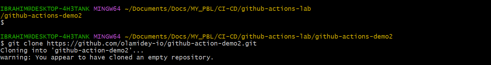

## Step 2: Create a Workflow Directory

* Create a directory for your GitHub Actions workflows: **mkdir -p .github/workflows**

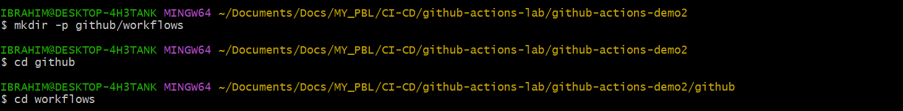

## Step 3: Create a Simple Workflow

* Create a new workflow file: touch .github/workflows/main.yml

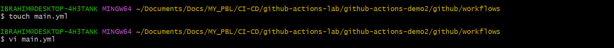

* Open main.yml in your favorite text editor and add the following content to define a simple workflow:

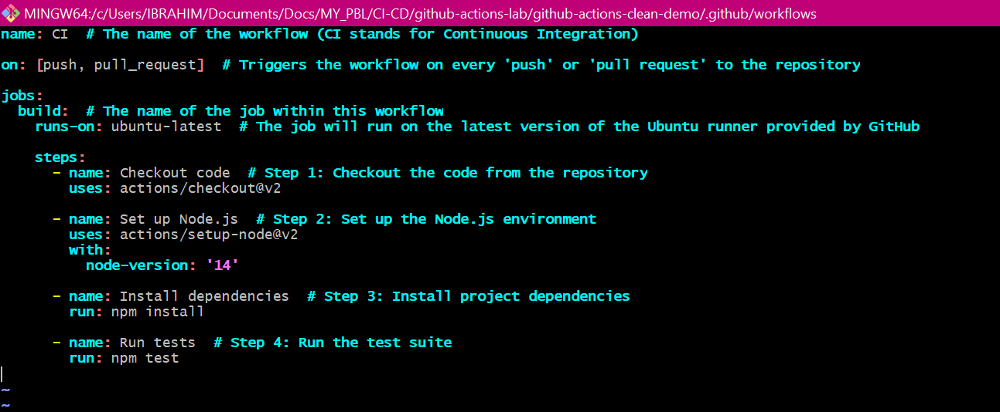

* If i stage this workflow and push to remote repository just like that, i will get a build error under "actions" because package.json file is missing in my project directory. For **npm test** to work, GitHub expects that there is a package.json file in the root of your repo (where it is running the command). The package.json file tells Node.js what your app is about. So, if package.json is missing, then npm test has no idea what to run — and it fails!. Images shared below

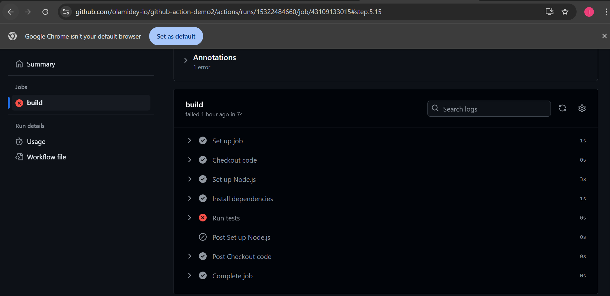

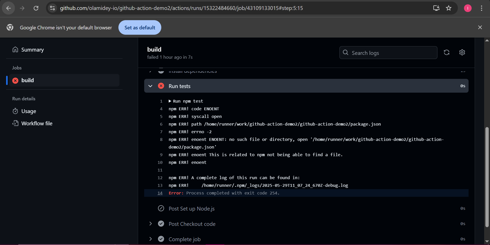

* To fix this, go back to the directory where your project lives and run **npm init -y** to add the **package.json** file

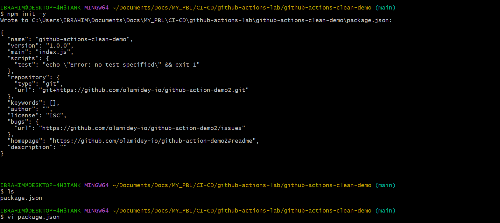

* Open the file and edit the script

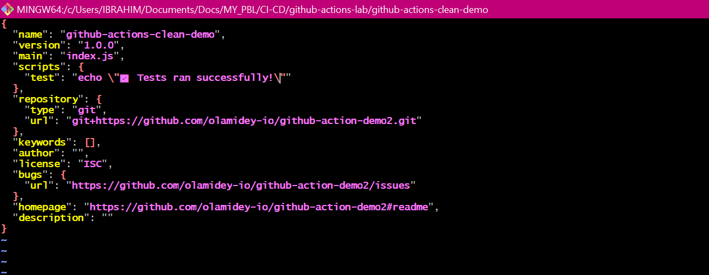

* Stage your changes and push to the remote repo

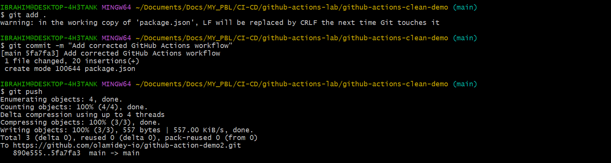

* Go back to GitHub → Actions tab → Watch your CI/CD workflow run again, now successful.

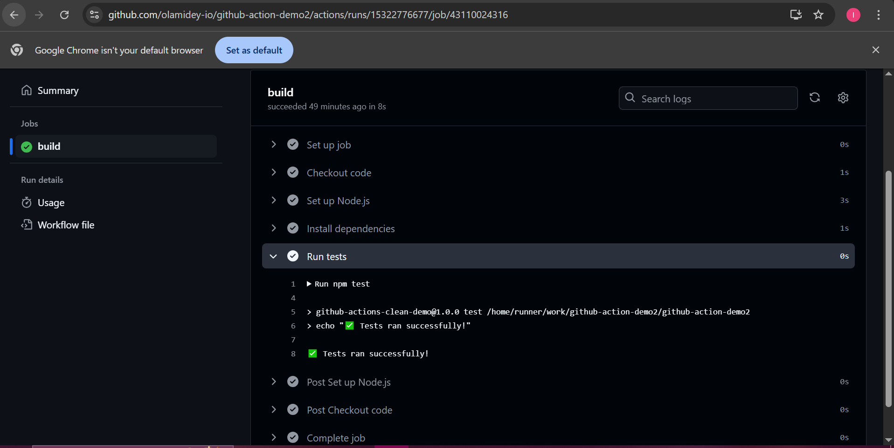

## Step 4: Trigger the Workflow

#### Why “Triggering the Workflow” is Important

When you're using GitHub Actions, the whole point is to automate tasks like: Testing your code, Building your app, Deploying to a server or cloud platform (like AWS, Netlify, etc.), Sending notifications, etc.

But for GitHub Actions to run, it needs a trigger — just like a light switch needs to be flipped. According to what i have in my workflow file, my trigger is **push** and **pull trigger**. This means: “Any time you push a change to the main branch, run this workflow.”

*  So i will make a change to your repository and push it to trigger the workflow. Go to the "Actions" tab in your GitHub repository to see the running workflow. The change i am making is adding an md file to the repo

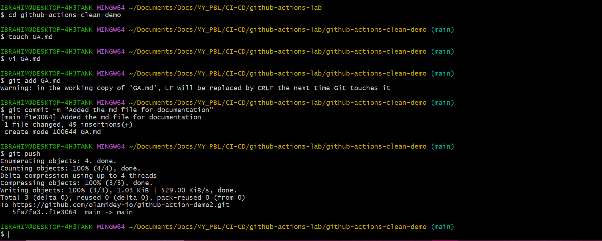

* So after pushing this change, the workflow gets triggered.

#### What a Workflow Does in Simple Terms:
A GitHub Actions workflow automates tasks whenever specific events happen in your repository (like push or pull_request), in my own case either push or pull request. After staging th latest change and pushing, here is what happens:

* GitHub sees the trigger. So GitHub says “Oh, a push happened on the main branch — I need to run this workflow!”
* A GitHub Actions runner is started:
GitHub spins up a temporary virtual machine (usually Ubuntu by default) — this is like a clean Linux machine in the cloud.
* The runner runs each step defined in your workflow, like:
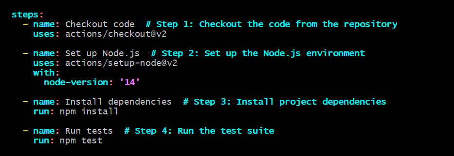
* The output (success or failure) is reported in the "Actions" tab of your repo:

    ✅ If tests pass: GitHub says "Your code passed the automated tests."

    ❌ If tests fail: It shows which step failed and the error logs.

#### Why Is This Useful?

* Catches bugs early: Before merging a PR or pushing code to production.
* Automates repetitive tasks: Like installing packages, running tests, or even deploying.
* Rejects bad code: If tests fail, you know something broke.
* Ensures team standards: Everyone’s code goes through the same checks. 

### So after pushing the changes to the remote repo which in turn triggered my workflow, the test passed as shown below:

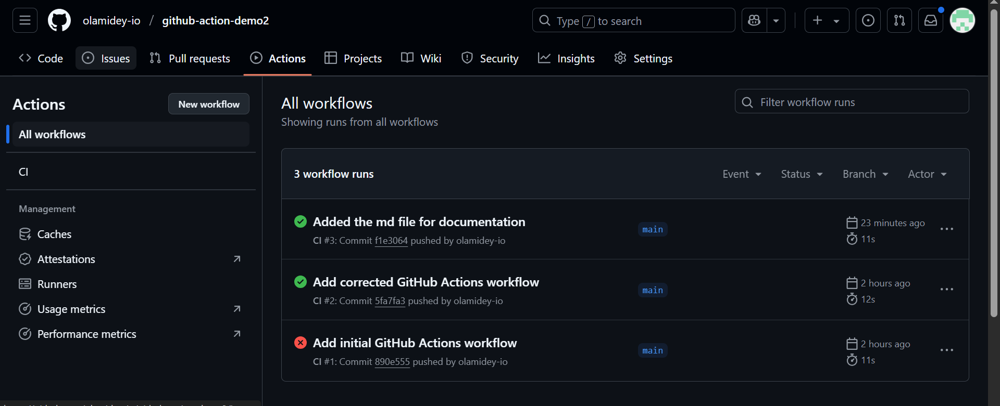
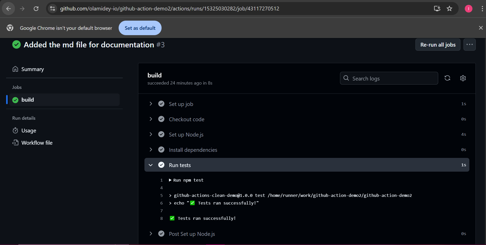

### Step 5: Create a Workflow with Multiple Jobs

I am enhancing my GitHub Actions workflow by splitting tasks into separate jobs — **build and lint.** This is a powerful DevOps practice that improves efficiency, parallelism, and clarity in your CI pipeline. The workflow and package.json file shown below

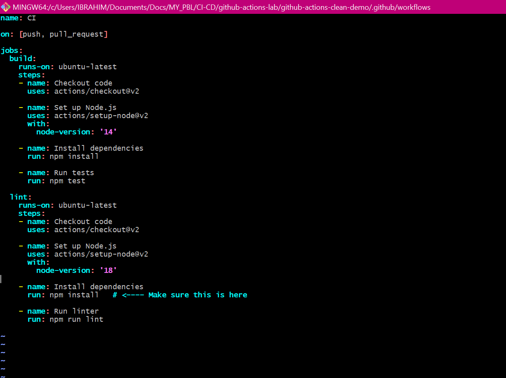

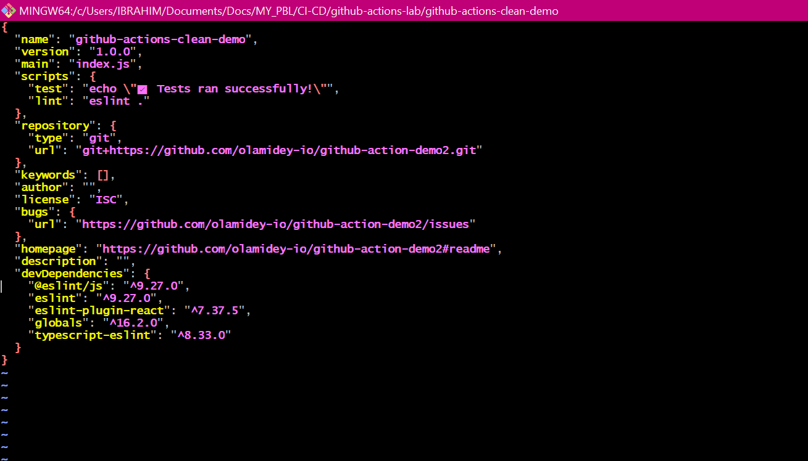

#### Workflow Breakdown

* **name: CI**
    * This sets the name of the workflow as CI, short for Continuous Integration. It'll show up with this name in your GitHub Actions tab.

* **on: [push, pull_request]**

    *  This tells GitHub: "Run this workflow every time I push code or open a pull request."
    * It ensures your code is automatically tested and linted whenever changes happen.

* **Jobs: Section**

This is where the actual work happens. You define separate jobs that can run independently (and even in parallel).

* **Job 1: Build**
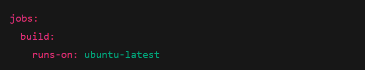

* The job is called build.
* It runs in a Linux environment using the latest version of Ubuntu on GitHub-hosted runners.

* **Step 1: Checkout Code**
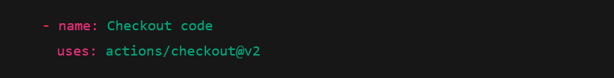

* This clones your repository into the virtual runner, so the rest of the job can access your files.

* **Step 2: Set up Node.js (v14)**
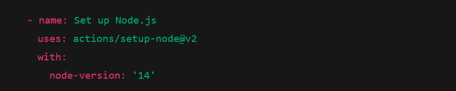

* Installs Node.js version 14 for this job.
* This is needed so npm commands work properly.

* **Step 3: Install Dependencies**
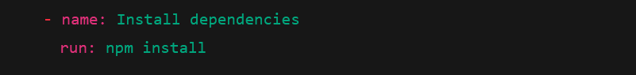

* Runs npm install to install everything from your package.json into node_modules.

* **Step 4: Run Test**
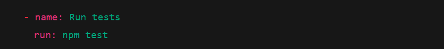

* Executes your project’s test suite (if you’ve defined one in the "test" script inside package.json).

### Job 2: Lint
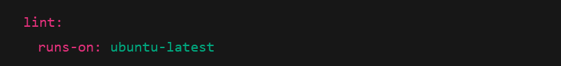

* This job is separate from build and also runs on Ubuntu.

* **Step 1: Checkout Code (again)**
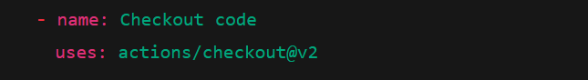

* Each job gets a fresh environment, so you need to checkout the code again.

* **Step 2: Setup Node.js (V18)
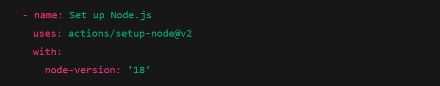

* Installs Node.js v18 here (different from build job's v14).
* This version includes better support for newer JS features, which ESLint may require.

* **Step 3: Install Dependencies (again)**
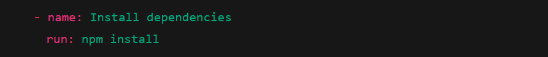

* Again, fresh environment means you need to reinstall dependencies.

* **Step 4: Run Linter**
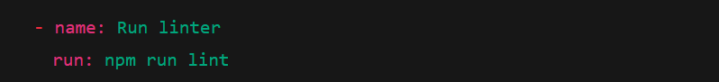

* Runs the linting process using the lint script defined in package.json, usually something like:

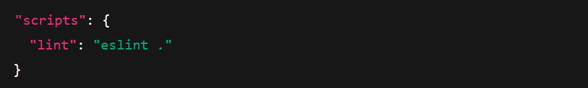

### Summary of the Flow
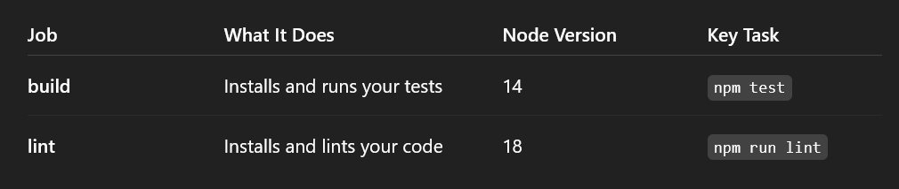

### So the lint job basically installs and lints my code.
### “Install” – What’s Being Installed?: When you run npm install, you are telling node.js to do the following:
* Look at your package.json file.
* Download and install all the dependencies listed (e.g. eslint, jest, react, etc.).
* Store them in a folder called node_modules.

So "Install" means setting up all the tools your project needs — especially eslint, which is required to lint your code.

### “Lints My Code” – What Is Linting?

Linting means automatically checking your code for errors, bad practices, or style violations. You usually do this with a tool like ESLint, which scans your JavaScript/TypeScript files and flags things like:
* Missing semicolons
* Unused variables
* Incorrect indentation
* Deprecated syntax
* Potential bugs

So linting helps you:
* Catch bugs early
* Keep your code clean and readable
* Follow coding best practices

### On the other hand, the build job installs and runs my test
### "Installs" — Same as the lint job
When you run **npm install**, it does the same thing as before:
* Looks into package.json
* Installs all dependencies (e.g. jest, mocha, chai, etc.)
* Prepares your project to run tests or build scripts

### "Runs your test" — What does this mean?
This refers to **npm test**
This command triggers your automated test scripts. These are small pieces of code written to:
* Check that your app behaves correctly
* Prevent bugs from creeping in during changes
* Confirm your code’s logic is sound

### So in summary:
### “Installs and runs your test” =
* npm install → sets up your testing tools (like jest)
* npm test → runs all the test files to make sure your app works properly

Lint was installed using **npm install eslint --save-dev** and lint was initialized as shown below

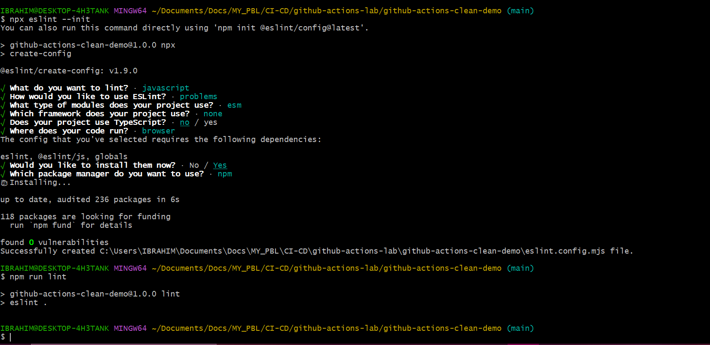

So after several several failed attempts to run lint successfully and later got it it resolved with series of troubleshooting, the test finally ran.

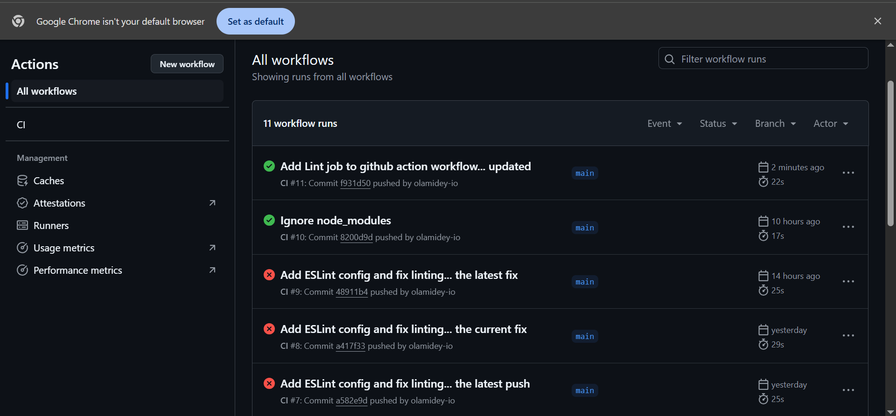

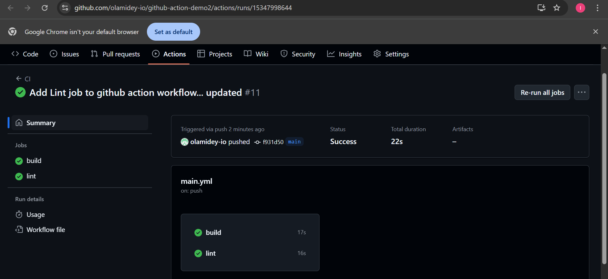

## Step 5:  Use Secrets in Your Workflow

I will try to securely store sensitive data (like passwords, tokens, or API keys) and use them inside my workflow without exposing them publicly in my code.

### Why use secrets?

Imagine your project needs:
* A database password
* A GitHub personal access token
* An API key to access a third-party service

❌ You should never hard-code those values in your YAML file because:
* Your code is usually public (or visible to team members)
* It creates a security risk (people can steal your keys)

✅ Instead, we use GitHub Secrets, which:
* Are encrypted and hidden
* Can be safely referenced inside your workflows

### To add Secret

* Go to your repository’s Settings tab.
* Under Security, click Secrets and variables > Actions.
* Click New repository secret.
* Add a new secret (for example, MY_SECRET) with a value.

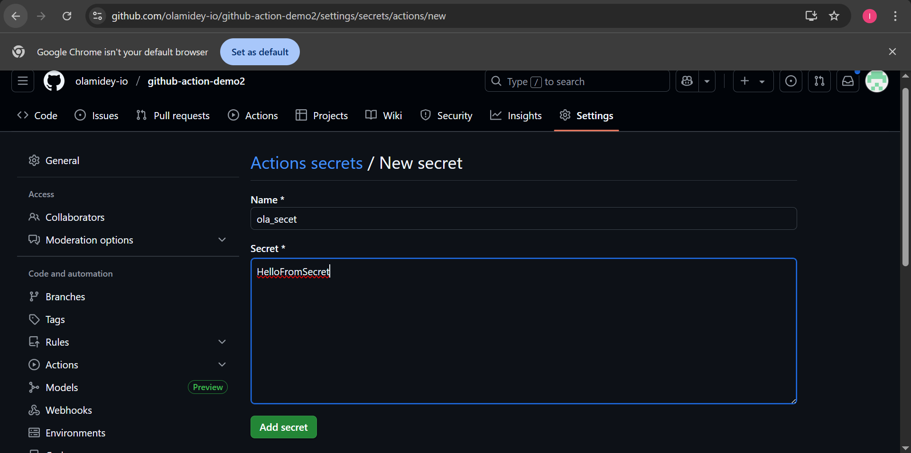
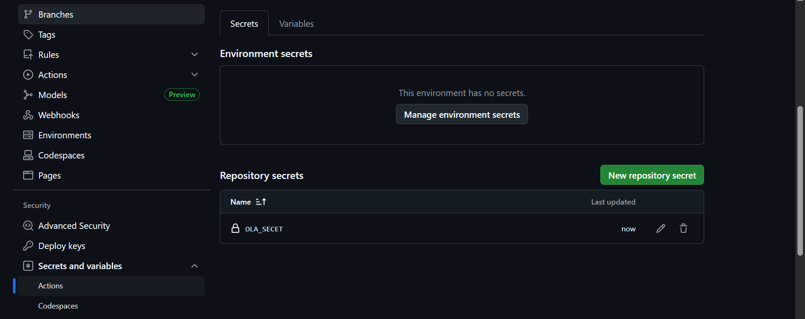

### Now, modify your main.yml to use the secret:

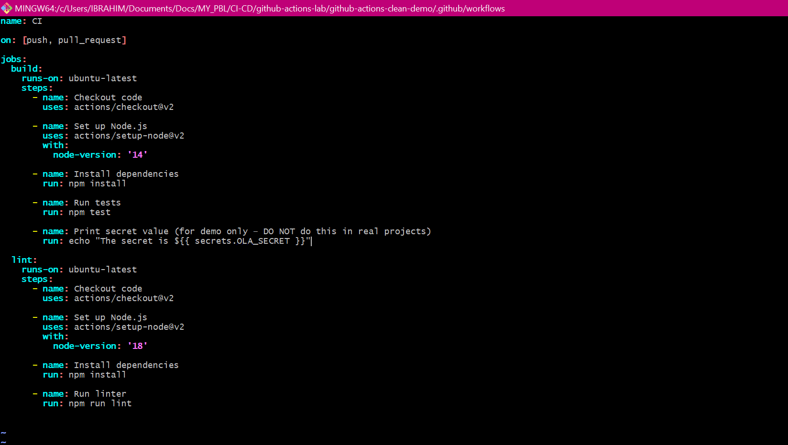

* After making modifications to the workflow and pushing the change to trigger the workflow, here is what i have below

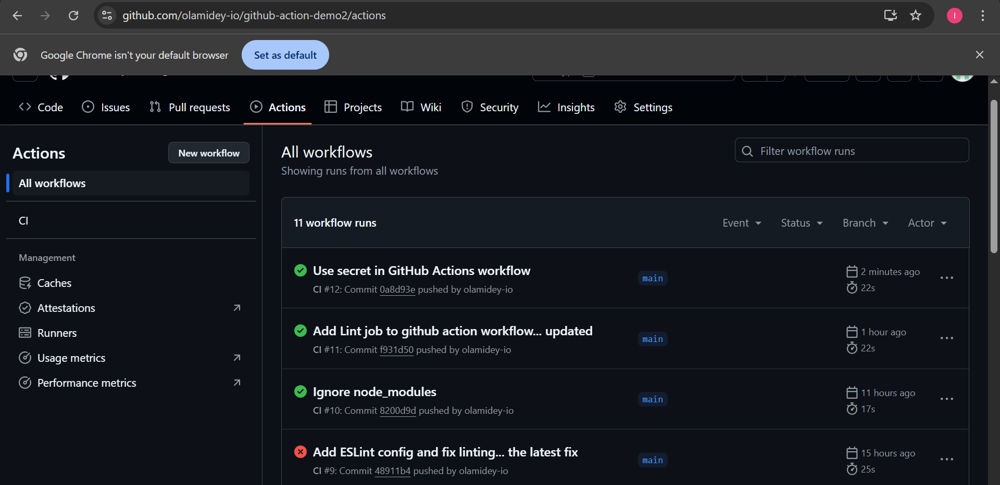

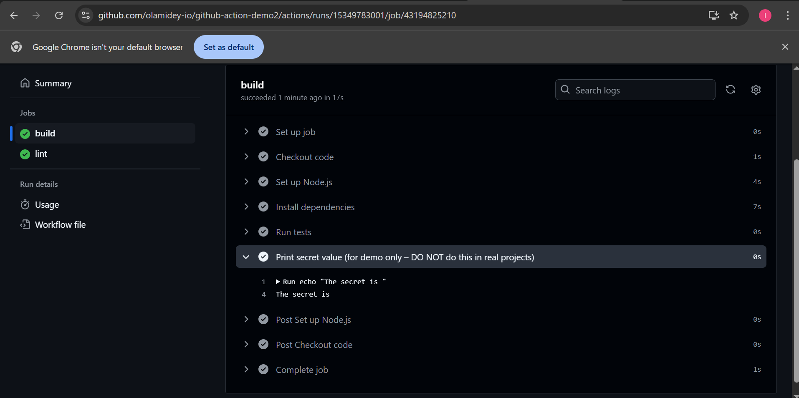
